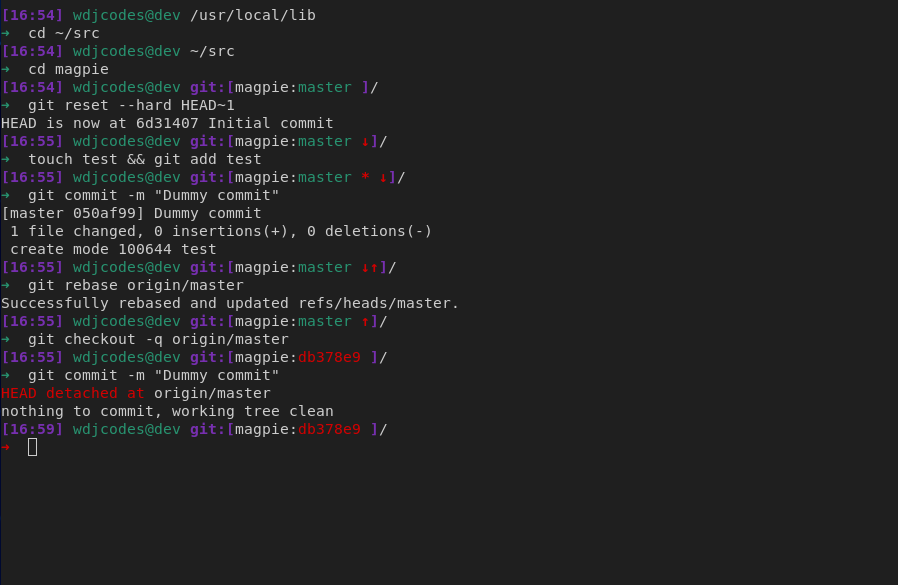

# magpie Theme for Oh My Zsh
In addition to customizing color scheme to my personal preference, magpie also adds some custom logic to display paths relative to the root of the current git project.

Note that the the preview shown below is based on the custom color profile, [shady](https://github.com/wdjcodes/shady),  I use for my kitty terminal



## Install
Run the following commands:
```sh
ZSH_CUSTOM=$ZSH_CUSTOM zsh -c "$(curl -fsSL https://raw.githubusercontent.com/wdjcodes/magpie/master/install.sh)"
```


## async git prompt
OMZ git plugin implemented async prompt functions to improve performance in certain git repos. In order for magpie's git prompt to continue to function one of the following must be added to `.zshrc` before OMZ is sourced.

To use async prompts (recommended) `zstyle ':omz:alpha:lib:git' async-prompt force`

To disable async prompts `zstyle ':omz:alpha:lib:git' async-prompt no`
